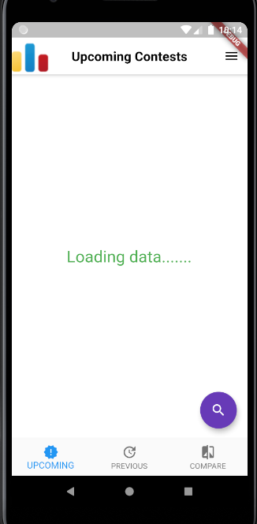
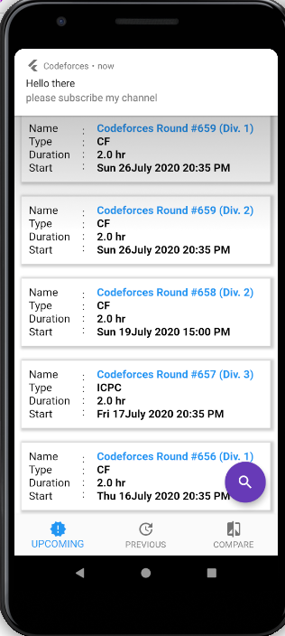
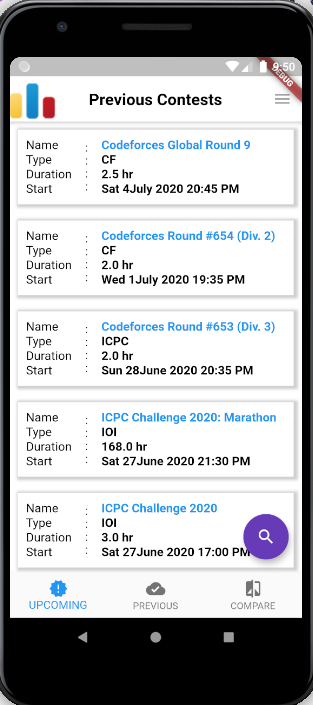
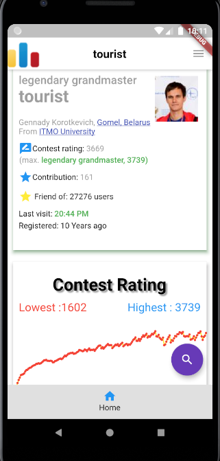
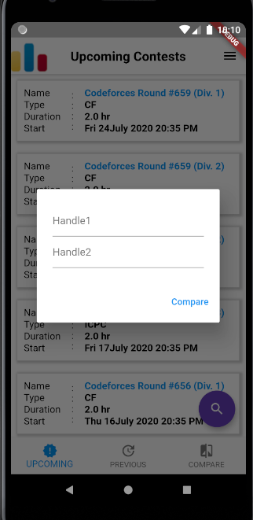
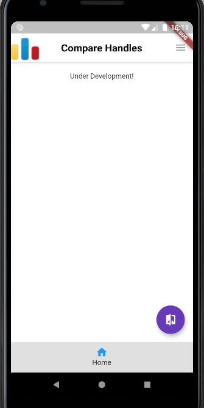

# Codeforces App

This is a android application based on Codeforces.

## Features

- Show upcoming contest
- Click and Notification for upcoming contests
- Check previous contests
- Open previous contests in browser
- Search Handles
- User profile details
- Compare two handles

**Note : Under Development**

## Screenshots

- Loading Screen

    

- Upcoming Contests

    

- Notification

    

- Previous Contests

    

- Open Browser

    

- Search Handle

    

- Handle Details

    

- Compare handles

    

- Comapre Result

    

## Technologies used 
- Programming Language :
  - Dart
- Framework:
  - Flutter

  - dependencies:
    - flutter:
      - sdk: flutter

    - http: 0.12.1
    - intl: 0.16.1
    - flutter_local_notifications: 1.4.4+2
    - android_alarm_manager: 0.4.5+11
    - intent: 1.3.4
    - url_launcher: 5.5.0
